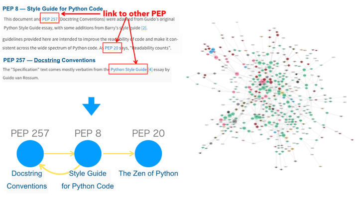
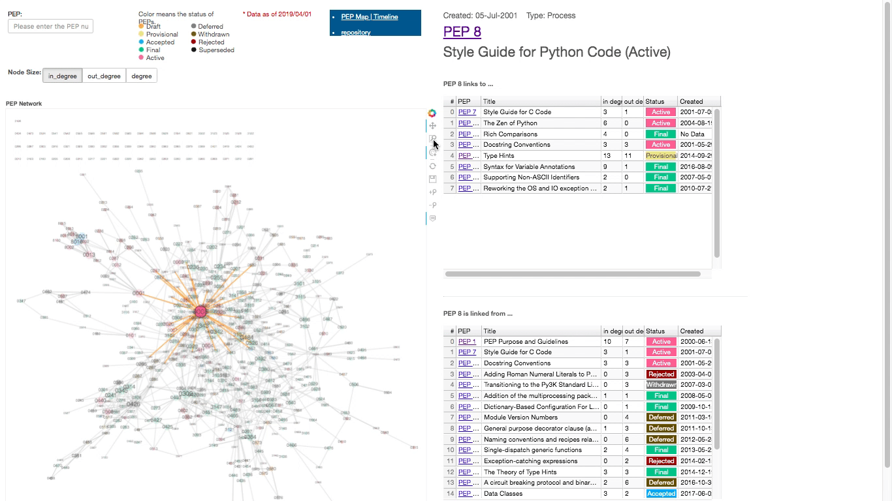

# SciPy Japan 2019 talk

SciPy Japan 2019: https://www.scipyjapan2019.scipy.org/

## Let's Enjoy the Python World Using Network Analysis ~ Overlooking the reference relationship of PEPs with NetworkX

This talk introduce discovery about reference relation between PEP (Python Enhancement Proposals) obtained using NetworkX.    

Network analysis is an approach used to explore the relationship structure between "something" and "something" (e.g. friendship network, citation network).  By focusing not only on individual elements but also on relationships, you may get new insight. If you are a Python user, NetworkX will help you get started with network analysis.

This talk will also introduce a website that interactively visualizes PEP's reference relationships (https://github.com/komo-fr/pep_map_site).

- Speaker: Tomoko Furuki (Twitter: [@komo_fr](https://twitter.com/komo_fr))
- Slide: https://bit.ly/2KVRh2t
- Jupyer Notebook:
  * [01-prepare_and_see_data.ipynb](https://github.com/komo-fr/SciPyJapan_2019_talk/blob/master/notebooks/01-prepare_and_see_data.ipynb)
  * [02-draw_network](https://github.com/komo-fr/SciPyJapan_2019_talk/blob/master/notebooks/02-draw_network.ipynb)
  * 03-community_detection (coming soon)
- Web Site (Interactive Visualization)
  * PEP Map: https://github.com/komo-fr/pep_map_site 
  * Network: https://komo-fr.github.io/pep_map_site/network.html 
  * Community Detection: https://komo-fr.github.io/pep_map_site/louvain.html
 
### Interactive Visualization
#### Network
https://komo-fr.github.io/pep_map_site/network.html    
See Also: [02-draw_network](https://github.com/komo-fr/SciPyJapan_2019_talk/blob/master/notebooks/02-draw_network.ipynb)

